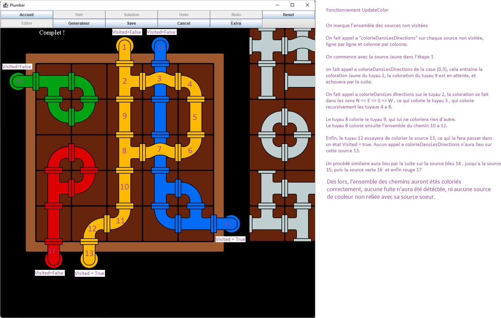
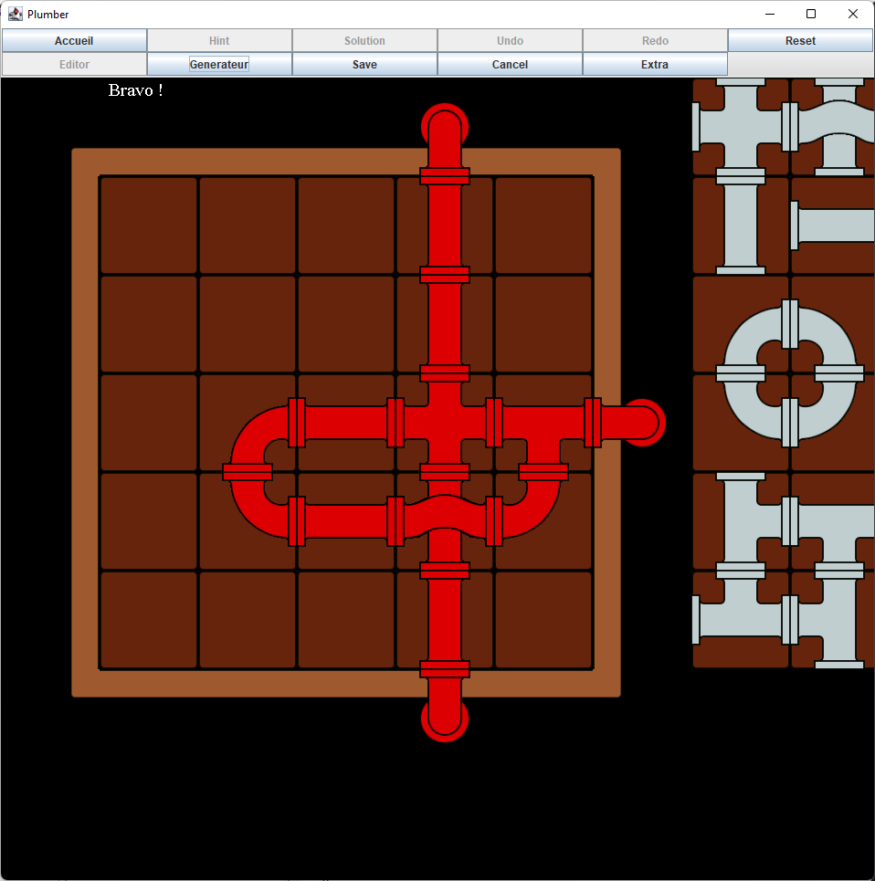
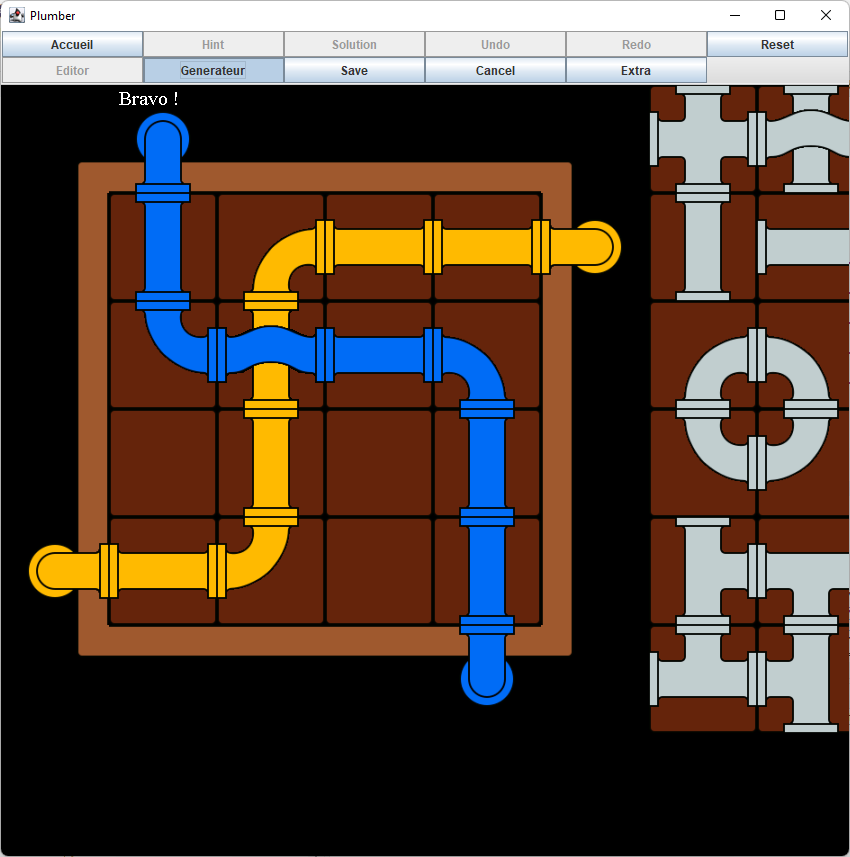
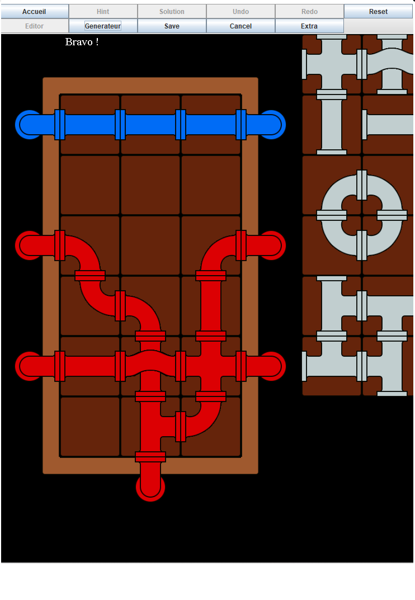

Rapport du projet d'Interface Graphiques : PLUMBER
======================

**Binôme 22 :  SU LiFang / WANG Laura**

------------

# Final Rendu projet

## 1. Introduction
  
 Ce projet a pour objectif de mettre en pratique ainsi qu’approfondir nos connaissances acquises tout au long de notre cursus, il nous mène à améliorer nos conceptions sur le langage Orienté Objet Java et maîtriser la bibliothèque de Java Swing.
 
Il est encadré par M. Vincent Padovani et M. Olivier Carton et représente l'unité d'enseignement "Interfaces Graphiques" de notre premier semestre de master.

## 2. Objectif
 
 L'objectif principal du projet est de mettre en place une interface du jeu de plombier. L'utilisateur doit réaliser un chemin sur un plateau de jeu entre une ou plusieurs sources, à partir d'un répertoire de niveau avec des tuyaux pouvant être déplacés à la souris par l'utilisateur.
 
## 3. Concept du projet
 
 **JAVA** : Java est un langage de programmation orienté objet. Les logiciels sont écrits dans ce langage de qui sont compilés vers une représentation binaire.
  
 **SWING** : Swing est une bibliothèque graphique pour le langage de programmation Java, faisant partie du package fondation classe Java.
  
 **MVC** : MVC est une abréviation de l’expression `Modèle-Vue-Contrôleur`. Il s'agit d'un modèle de conception de logiciels. Le point important de ce modèle est d'avoir une meilleure organisation du code présent au sein du projet.
 
## 4. MVC
 
Le **modèle** est composé de toutes les données du programme, les niveaux du jeu, l'image contenant les tuyaux et la programmation concernant ses fichiers qui seront au back-end.
 
La **vue** est composée de fichiers visuels. Par conséquent, il s'agit de ce qui sera affiché à l'écran de l'utilisateur.
 
Le **contrôleur** est composé de toutes les interactions de l'utilisateur à l'ordinateur, la manipulation de la souris, les raccourcis clavier.
 
### 4.1. Model

#### 4.1.1 Énumérations
Afin de faciliter les actions futures, les énumérations suivantes sont nécessaires :
 
Type `S`,`L`,`O`,`T`,`F`,`C`,`V` correspondant aux type de tuyaux possibles : `SOURCE`, `LINE`, `OVER`, `TURN`, `FORK`, `CROSS`, `VISSAGE/DEVISSAGE`.
 
Orientation `N`,`E`,`S`,`W` afin de pouvoir mettre à jour les cases et les tuyaux dans ces directions
 
Couleur `W`,`R`,`G`,`B`,`Y`,`BL` regroupant l'ensemble des couleurs modélisables par le programme.
 
#### 4.1.2. Lecture des fichiers
 
Le model est conçu initialement par la lecture de l'un des fichiers `.p` présent dans une des deux banques de données (Editable et Non-Editable) permettant de modéliser deux grilles , une principale correspondant au plateau, ainsi qu'une servant de sauvegarde pour la solution.
 
#### 4.1.3. Grille
Les grilles représentent notre plateau via un tableau de tuyaux.
 
#### 4.1.4. Gestion des Tuyaux
Les objets de type `tuyaux` sont l' élément central de notre programme. Ils comprennent entre autres un type, une orientation , une ou deux couleurs (tuyau de type `OVER` ) , ainsi que leur image définie en fonction des précédents éléments.
 
 De plus , ils contiennent un tableau de booléen permettant de définir leur côté d'ouverture selon leur type et orientation.
  
 ### 4.2. View
 
#### 4.2.1 MainApp
Mainapp est la classe permettant de lancer le programme. Cette classe contient la fonction Main, qui génère un `JFrame` auquel sera ajoutée une vue de type `AccueilView`.
La résolution du programme s'adapte selon la taille de l'affichage : la taille de chaque image correspond à un pourcentage de la résolution.
 
#### 4.2.2. AccueilView
Accueilview permet l'apparition d'un menu d'accueil. Ce menu permet de choisir parmi 2 banques de niveaux, éditables ou non éditables.
Le clique sur l'un des boutons permet de lancer le jeu sur le niveau sélectionné ( `GrilleView` ).
 
 #### 4.2.3. GrilleView
 Cette classe s'ajoute sur la JFrame globale pour remplacer AccueilView.
 Un menu est généré avec diverses fonctions proposées :
  
 `Accueil` => Renvoi au menu d'accueil AccueilView.
 `Hint` => propose une solution aléatoire de la solution originale du niveau.
 `Solution` => montre la grille solution correspondant au niveau.
 `Undo / Redo` => permet de revenir en arrière, ou de refaire l'action.
 `Reset` => réinitialise le niveau.
 `Editor` => active le mode d'édition. Cela entraîne la possibilité de déplacer un nombre illimité de tuyaux, de déplacer les sources, mains aussi d'avoir accès aux 4 boutons suivants :
 `Generateur` => génère un niveau aléatoire en fonction des sources positionnées.
 `Save` => permet d'enregistrer le niveau, après confirmation, si le niveau est complet. 
 `Cancel` => Annule le mode édition, avec confirmation, et réinitialise le niveau.
 `Extra` => Permet à l'utilisateur d'avoir accès à des fonctions d'édition avancées : Ajout de nouvelles sources colorées , visser/dévisser un tuyau, modifier la géométrie d’un niveau en ajoutant ou supprimant des lignes ou colonnes.

### 4.3. Controler
 
Pour une meilleure organisation du code, nous avons créé une méthode qui va pouvoir initialiser toutes les actions des boutons de la barre de menus. La répétition dans un code est indispensable, nous avons créé plusieurs listes qui permettent de stocker les codes quasiment identiques, nous les utilisons avec une boucle de même nombre de case que la réserve.
 
Pour une meilleure manipulation du logiciel, nous avons ajouté des raccourcis au clavier. En raison du grand nombre de répétitions, nous ajoutons les raccourcis dans une liste de raccourcis. Nous finissons par une boucle qui associe la liste des mots et la liste des raccourcis de leurs boutons dans l'ordre. L'ordre de stockage dans les listes est très important, un oubli ou un mélange entrainera un décalage entre les raccourcis et les boutons.
 
## 5. Détection de la configuration gagnante
 
La configuration gagnante est détectée dans tous les cas via les fonctions suivantes :
 
 ### 5.1 Fonction updateColor
 La mise à jour des couleurs se fait via la fonction "int updateColor" présente dans la classe `Model`.
 
Cette fonction renvoi :
-  `0`  : Si la configuration est gagnante = l'ensemble des sources colorées sont reliées entre elles , il n'y a aucun tuyau polychrome ni aucune fuite.
-  `1`  : Si la solution est partielle : l'ensemble des sources colorées sont reliées entre elles , il n'y a aucun tuyau polychrome , mais qu'une fuite persiste ( utilisé dans le générateur).
-  `2`  : Si la solution est perdante.
 
Fonctionnement de cette fonction :
- L'ensemble des sources sont marquées comme n'étant pas visitées
- On scan l'ensemble des sources non visitées en notant chaque couleur séparément
- Si plus d'une source de même couleur non visitée est scannée , la configuration est perdante  :les tuyaux ne sont pas reliés entre eux
- On fait un unique appel à la fonction "void colorieDansLesDirections" depuis chaque source non visitée afin de propager la couleur jusqu'aux autres sources.
  Chaque autre source visitée est marquée comme étant visitée.
  

 
 ### 5.2 Fonction colorieDansLesDirections
  
 Cette fonction propage la couleur depuis chaque source, en vérifiant pour chaque case juxtaposée (Nord Sud Est West) accessible depuis la case actuelle ( présentant une ouverture vers la case cible) , si la case cible est ouverte vers la case actuelle.
  
 Ainsi, si un lien est détecté entre les deux cases, la couleur de la cible sera mise à jour.
  
 - Si le tuyau cible est blanc, il passe de la couleur de la case actuelle , et un appel récursif à `colorieDansLesDirections` a lieu sur cette case cible.

 - Si le tuyau cible est une source d'une couleur identique, la cible sera marquée comme étant visitée. Il n'y aura donc pas d'appel depuis cette source dans `updateColor`
  
 - Si le tuyau cible est un tuyau normal, d'une couleur identique, la fonction s'arrête. (Aucun besoin de recolorier un tuyau déjà colorié.)
  
 - Si le tuyau cible est d'une couleur différente, les tuyaux passeront récursivement de couleur Noire représentant le polychromise, et un appel récursif  à `colorieDansLesDirections()` aura lieu aussi, afin de mettre à jour l'ensemble du chemin de couleur polychrome.
  
 - Si la case cible est vide, une fuite sera détectée pour `updateColor`.
  
 Dans un but d'optimisation de l'algorithme, la fonction colorie Dans Les Directions prend en argument la direction de la case originale, à ne pas analyser inutilement.
  
 L'appel unitaire de cette fonction depuis chaque source permet la coloration correcte de l'ensemble des chemins ainsi que les détections des fuites et du polychromise, qui seront renvoyés par `updateColor()`.
 
 
 
### 6. Actions Supplémentaires
 
#### 6.1. Hint et Solution
La demande de `Hint` permet de verrouiller un tuyau aléatoire présent dans la solution originale, qui a été conservée dans la classe Model.
La demande de Solution consiste à afficher entièrement cette solution
 
#### 6.2. Undo et Redo
 
L'undoManager a été implémenté afin de permettre un undo/redo optimisé.
Pour cela la notion de mouvement sur la grille a été créée (Classe `Move`) enregistrant le tuyau concerné, les coordonnées sources et cibles.
Ces mouvements sont exécutables (`doit`) ou undoable (`undo`).
 
#### 6.3. Reset
Cette fonction réinitialise le niveau à sa configuration d'origine, en repartant depuis la solution en recréant les tuyaux.
 
 #### 6.4 AddListener
  
 Le principe d'addListenerAction le déplace des tuyaux dans la grille. Chaque mouvement doit être programmer par l'utilisateur soit même.

Le principe d'addListenerAction est de déplacer les tuyaux dans la grille. Chaque mouvement doit être effectué par l'utilisateur lui-même.
Lorsque l'utilisateur clique sur un tuyau qui se situe dans la réserve ou dans la grille, il pourra le déplacer n'importe où sans le lâcher. En même temps, le tuyau sera retiré de sa case initiale jusqu'à que l'utilisateur le dépose sur une case valide. Nous avons programmé cela dans une méthode mousePressed implémentée par la classe `MouseAdapte`. Nous retrouvons également dans cette classe, la méthode mouseDragged qui actualise la position du tuyau lorsque l'utilisateur maintient la souris et la méthode mouseReleased qui définit la position du tuyau lorsque l'utilisateur le relâche à une case valide du plateau.

Nous avons plusieurs contrainte pour chaque déplacement :

- La position initiale du tuyaux est un tuyaux déplaçable, dans la réserve ou dans la grille
- Le compteur du tuyaux dans la réserve ne doit être vide, sinon il n'y aura pas de ce type de tuyaux disponible
- La position de finale ne doit être vide et hors de la grille , sinon il doit retourner à la position initiale
- La position finale invalide depuis la réserve doit être retourner la réserve
- Eviter les déplacements des sources hors du mode éditeur

Le déplacement des tuyaux se fait de façon fluide a la souris.
Les clicks ( `mousePressed()` / `mouseReleased()` ) sur la réserve mettent en temps réel à jour le nombre des tuyaux restant ainsi que leur image s' il n'en reste plus.
Les clicks sur la grille entraînent un positionnement des tuyaux adéquats, mais aussi une mise à jour des couleurs.

#### 6.5. Editor 
Nous avons développé un mode éditeur, dont le principe de ce mode permet à l'utilisateur de pouvoir créer un niveau en concevant une nouvelle solution.

Nous commençons l'action editor à partir d'un bouton dans la barre de menus ou la lettre `E`, comme `Editor`, du clavier vu précédemment.
Le mode éditeur doit modifier plusieurs paramètres par rapport au mode normal. Nous devons tout d'abord limiter les accès des boutons inutiles durant le mode editor mais aussi pouvoir accéder aux boutons qui sont disponibles qu'en mode editor, puis changer du nombre des tuyaux en illimite.

En mode editor, nous n'avons plus accès au bouton "Hint" qui donne un indice, au bouton "solution" qui donne la solution de ce niveau les bouton `Undo et Redo`, puis nous avons accès au bouton `Save` qui enregistre un nouveau  niveau, `Cancel` qui quitte le mode editor et `Extra Édit` qui ajoute des options sur le plateau, expliquer ultérieurement.
 
Le bouton `Save` permet de sauvegarder le nouveau niveau valide. Nous devons tout d'abord créer un fichier qui sera nommé en fonction du nombre de fichiers commençant par `level` dans le répertoire.

Après la création du fichier, nous devons vérifier si la solution donnée par l'utilisateur est correcte, en faisant la vérification du parcours des tuyaux avec la fonction updateColor(false) dans la classe Model accessible par la classe GrilleView. Si la solution est correcte, nous pouvons commencer à parcourir la grille et écrire en dans le fichier créer précédemment case par case.Contrairement à la sauvegarde, le bouton "cancel" permet le mode éditeur, nous perdons toute la progression de la nouvelle solution et nous retournons en mode normal sur le niveau de départ. Tous les boutons que nous avons désactivés ou activés pour le mode éditeur seront alternés.
 
Lors de l'édition, de nouvelles sources peuvent être ajoutées, ainsi que de nouveaux tuyaux/cases peuvent être vissés ou dévissés.
Pour cela un clique sur l'action appropriée crée un nouveau tuyau déplaçable. La géométrie du niveau peut elle aussi être modifiée ( **ajout/suppression de lignes/colonnes** )

Pour les deux derniers boutons (`Save` et `Cancel`), nous avons configurer une boite de dialogue qui doit avoir la confirmation de l'utilisateur par un bouton `OK` ou `Cancel`.

## 7. Générateur
 
Le générateur est la partie la plus compliquée du programme car il à nécessité une forte optimisation des précédents algorithmes, surtout de la détection de la configuration gagnante.
 
Le générateur que nous avons conçu est de type "Bruteforce" et procède en plusieurs étapes :
 
 ### 7.1 Etape 1 : Bruteforce
  
 Des tuyaux aléatoires sont placés sur des cases aléatoires de la grille.
  
 Après chaque tuyau, une vérification de la configuration gagnante a lieu.
  
 Si la configuration n'est pas gagnante (`return 2`), un autre tuyau sera ajouté aléatoirement sur la grille.
  
 Cependant si la configuration est partielle (`return 1`), correspondant à une solution ou l'ensemble des sources de même couleur sont reliées, sans aucun polychromise, on pourra alors passer à l'étape suivante.
 
 ### 7.2 Etape 2 : Suppression des tuyaux blancs
  
 Les tuyaux blancs dans cette configuration sont considérés comme inutiles et polluants, ils sont donc supprimés lors de cette étape.
  
 ### 7.3 Etape 3 : Suppression des tuyaux inutiles
  
 Certaines solutions générées par bruteforce comportent des tuyaux colorés inutiles, n'intervenant pas dans le lien entre deux sources.
 Lors de cette étape, on va tester la suppression de chaque tuyau de la grille.
 Après chaque suppression, on va tester la détection de la configuration gagnante (`updateColor`). Si la configuration n'est plus ni gagnante ni partielle, et est passée perdante, alors on rollback cette suppression.
 Si la suppression n'a aucun effet, on conserve cette suppression.
 
### 7.4 Etape 4 : Lissage
 
Cette étape consiste à enlever l'ensemble des fuites présentes sur cette configuration.
 
Chaque case sera alors analysée afin de remplacer le tuyau présent par un tuyaux correspondant aux cases adjacentes.
 
 ### 7.5 Résultat de la génération
  
 Le générateur fonctionne parfaitement, le temps de génération est variable en fonction de la complexité du plateau (nombre de sources, taille du plateau), et de la puissance de l'ordinateur.
 Les niveaux mono-sources ont des solutions bouclées sur elles-mêmes.
 
 
 
 
 
 
  
 
## 8. Difficulté
 
Les plus grandes difficultés rencontrées ont étés :
 
- La conception d’un générateur de niveau aléatoire fonctionnant selon toutes les configurations de sources et de taille de niveau. 
- L’implémentation de la détection de la configuration gagnante, tout en optimisant l’ensemble de l’algorithme.
- L’implémentation de l’UndoManager.
- Le mouvement rectiligne de retour automatique à la position initial, lorsque la position finale n'est pas valide.
- Limitation de la création d'une solution existante.
 
 ## 9. Conclusion

Notre rendu fonctionne parfaitement. L'ensemble des besoins ont été implémentés, incluant le générateur de niveau aléatoire et l'intégration de l'undoManager Java.
 
 Ce programme a été testé sur diverses configurations, et aucun bug n'est à reporter.
 L'interface est intuitive et ergonomique, et le programme répond rapidement. 

 Ce projet nous a confronté à une potentielle situation professionnelle, et par la même occasion nous a permis d'améliorer nos capacités algorithmiques,et sur les aspects d'Interfaces Graphiques.
 Il nous a permis de nous perfectionner dans la programmation objet, plus précisément la langage Java.

 Le travail en binôme que nous avons dû réaliser, nous a amené à répartir la charge de travail, ainsi qu'à trouver une façon efficace de joindre nos compétences afin d'être les plus performants possibles.
