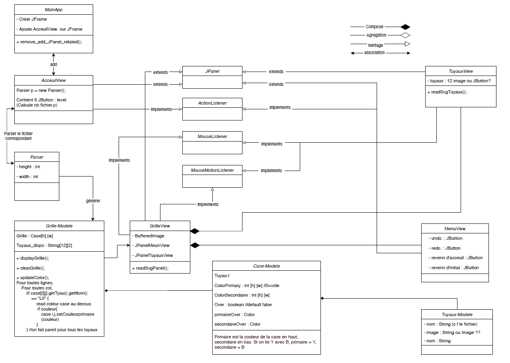
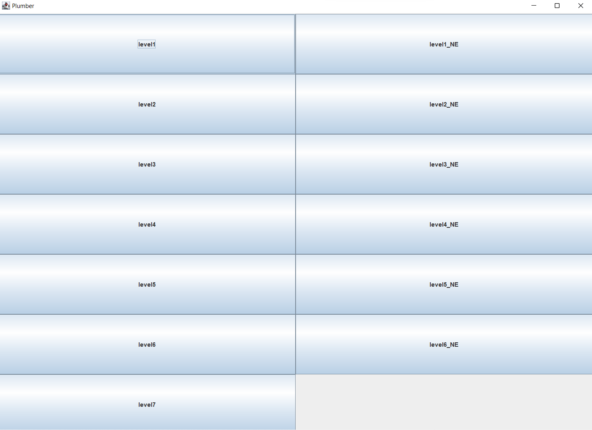
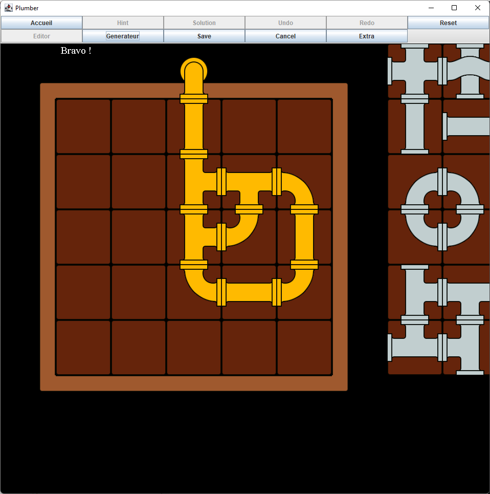
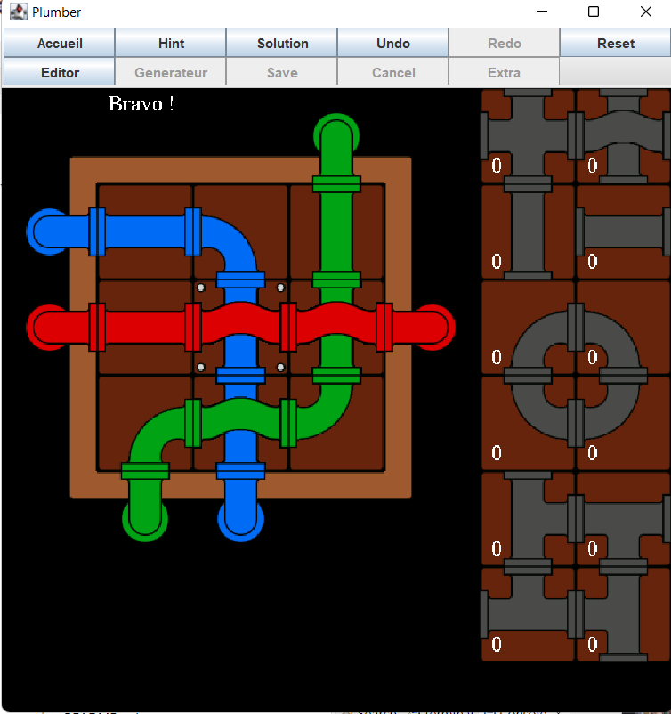

Interfaces graphiques M1 2021-2022
======================
 
**Binôme : SU LiFang / WANG Laura**
 
# Final Rendu projet

## Installation 

Pour installer le projet sur votre machine il faut :
* Télécharger notre dépôt de projet
* Lance le fichier `MainApp.java`

## Structure du projet

## Capture d'écran du projet

Nous avons développer plusieurs niveau de jeu, un coté éditable (gauche) et coté non éditable (droite).

Fonctionnalité Génerateur dans le mode Edition. Il permet de générer de nouvelle solution que la solution de base.

Une solution du jeu du niveau 2

## Rapport 
Pour connaitre plus de détaille du projet je vous laisse voir le rapport : [Rapport](Image/rapport.md)

